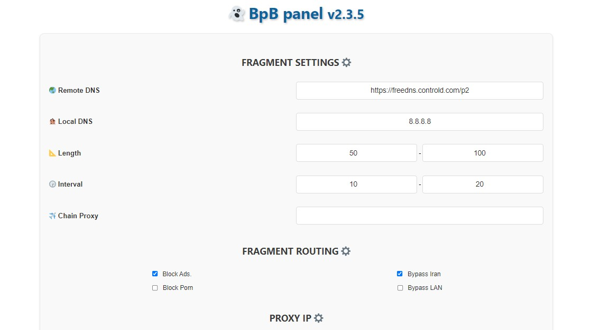
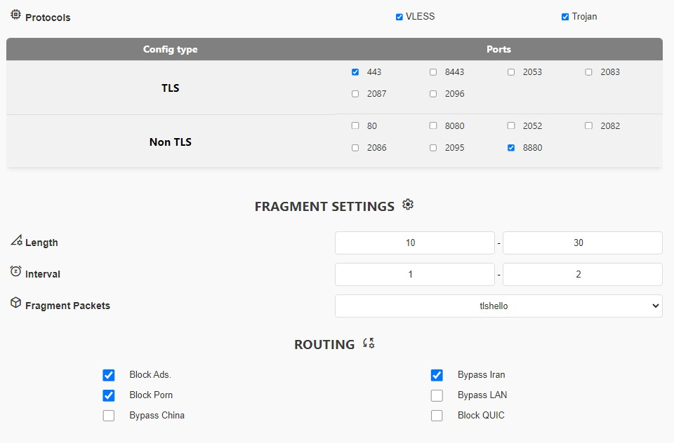
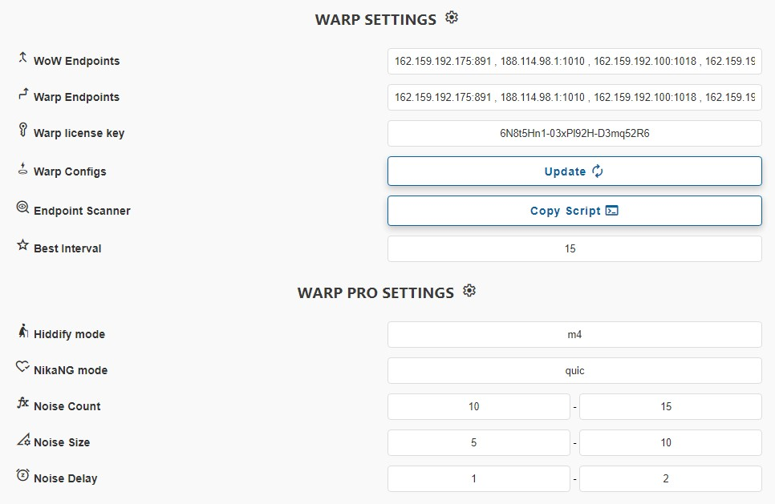
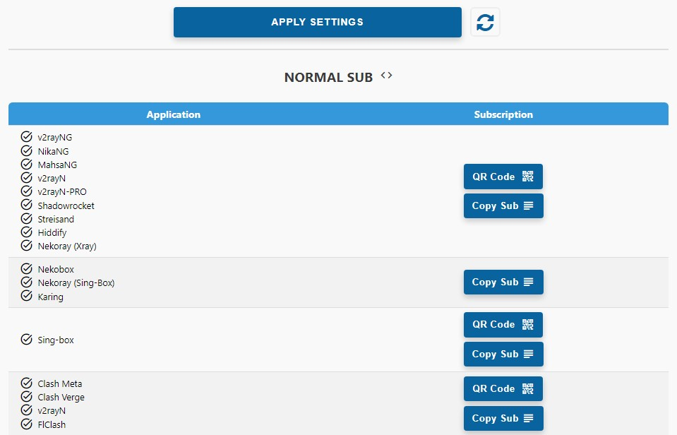

## $$\color{silver} \Large \text{BPB v2.5.5}$$

> __[🇮🇷Persian](README-fa.md)__     __[🇬🇧English](README.md)__


## table of contents
- [Introduction](#Introduction)
- [Features](#Features)
- [How to use](#How-to-use)
- [Variable description](#Variable-description)
- [Panel preview](#Panel-preview)  
- [Supported clients](#Supported-clients)


### Introduction
This project is dedicated to developing a user panel for the [Cloudflare-workers/pages proxy script](https://github.com/yonggekkk/Cloudflare-workers-pages-vless) created by [yonggekkk](https://github.com/yonggekkk).

HUGE THANKS TO
[bia pain bache](https://github.com/bia-pain-bache) for creating these amazing panel

 The panel offers two deployment options:
- __Worker__ deployment
- __Pages__ deployment
<br>


## Features

1. __Free__: No cost involved.
2. __User-Friendly Panel:__ Designed for easy navigation, configuration and usage.
3. __Protocols:__ Provides VLESS, Trojan and Wireguard (Warp) protocols.
4. __Warp Pro configs:__ Optimized Warp for crucial circumstances.
5. __Support Fragment:__ Supports Fragment functionality for crucial network situations.
6. __Full routing rules:__ Bypassing Iran/China and LAN, Blocking QUIC, Porn, Ads, Malwares, Phishing...
5. __Bypass Iran and LAN (Optional)__
6. __Full routing rules:__ Bypassing Iran, Blocking Ads, Malwares, Phishing... for Sing-box.
7. __Chain Proxy:__ Capable of adding a chain proxy to fix IP.
8. __Supports Wide Range of Clients:__ Offers subscription links for Xray, Sing-box and Clash core clients.
10. __Subscription Link (JSON):__ Provides subscription link for JSON configs.
11. __Password-Protected Panel:__ Secure your panel with password protection.
12. __Fully customizable:__ Ability to use online scanner and setting up clean IP-domains, Proxy IP, setting DNS servers, choosing ports and protocols, Warp endpoints...
<br>

## How to use
- [Installation (Pages)](docs/pages_installation_fa.md)

- [Installation (Worker)](docs/worker_installation_fa.md)

- [Scanning Proxy IP](docs/proxy-ip-scanner.md)

- [How to use](docs/configuration_fa.md)

- [FAQ](docs/faq.md)
<br>


## Variable description
> For further information on how to create variables, please refer to [this link](https://github.com/bia-pain-bache/BPB-Worker-Panel/blob/main/docs/pages_installation_fa.md#3--%D8%AA%D8%BA%DB%8C%DB%8C%D8%B1-%D9%BE%D8%B3%D9%88%D8%B1%D8%AF%D9%87%D8%A7%DB%8C-trojan).


| Variable Name | Example | Required | Remark |
|-----|----|--|------------|
| UUID | `90cd4a77-141a-43c9-991b-08263cfe9c10` |✅| To generate your own UUID refer to [this link](https://www.uuidgenerator.net/) |
| PROXYIP | `bpp.radically.pro` |❌| Alternative as a proxy node for accessing CloudFlareCDN site (supports multiple ProxyIPs, ex: ```['bpb.radically.pro', 'bpb.yousef.isegaro.com'];``` To find proxyIP [check here](https://github.com/NiREvil/vless/blob/main/sub/ProxyIP.md) |
| TROJAN_PASS  | `REvil` |✅| Your preferred password |
| HASH_PASS | `6dfd0e8e67ad3230498f80938cb924bc767b7` |✅| Your preferred trojan password should be converted to SHA-224 Hash string to securely store password and verify data integrity, To perform this conversion refer to [this link](https://emn178.github.io/online-tools/sha224.html) |


## Panel preview

<p align="center">
  
</p>

<p align="center">
  
</p>

<p align="center">
  
</p>

<p align="center">
  
</p>

<br><br>

---
## Supported clients  

| Client  | Version | Fragment | Warp Pro |
| :-------------: | :-------------: | :-------------: | :-------------: |
| __v2rayNG__  | 1.8.19 or higher  | :heavy_check_mark: | :x: |
| __v2rayN__  | 6.42 or higher  | :heavy_check_mark: | :x: |
| __v2rayN-PRO__  | 1.4 or higher  | :heavy_check_mark: | :heavy_check_mark: |
| __Nekobox__  |   | :x: | :x: |
| __Sing-box__  | 1.8.10 or higher  | :x: | :x: |
| __Streisand__  |   | :heavy_check_mark: | :x: |
| __V2Box__  |   | :x: | :x: |
| __Shadowrocket__  |   | :x: | :x: |
| __Nekoray__  |   | :heavy_check_mark: | :x: |
| __Hiddify__  | 2.0.5 or higher  | :x: | :heavy_check_mark: |
| __NikaNG__  |   | :heavy_check_mark: | :heavy_check_mark: |
| __Clash Meta__  |   | :x: | :x: |
| __Clash Verge Rev__  |   | :x: | :x: |
| __FLClash__  |   | :x: | :x: |

---

## Stargazers Over Time
[](https://starchart.cc/bia-pain-bache/BPB-Worker-Panel)

---

### Special Thanks
- CF-vless code author [3Kmfi6HP](https://github.com/3Kmfi6HP/EDtunnel)
- CF preferred IP program author [badafans](https://github.com/badafans/Cloudflare-IP-SpeedTest), [XIU2](https://github.com/XIU2/CloudflareSpeedTest)

---

For a detailed tutorial on the core script, please refer to [Yongge’s blog and video tutorials](https://ygkkk.blogspot.com/2023/07/cfworkers-vless.html).
