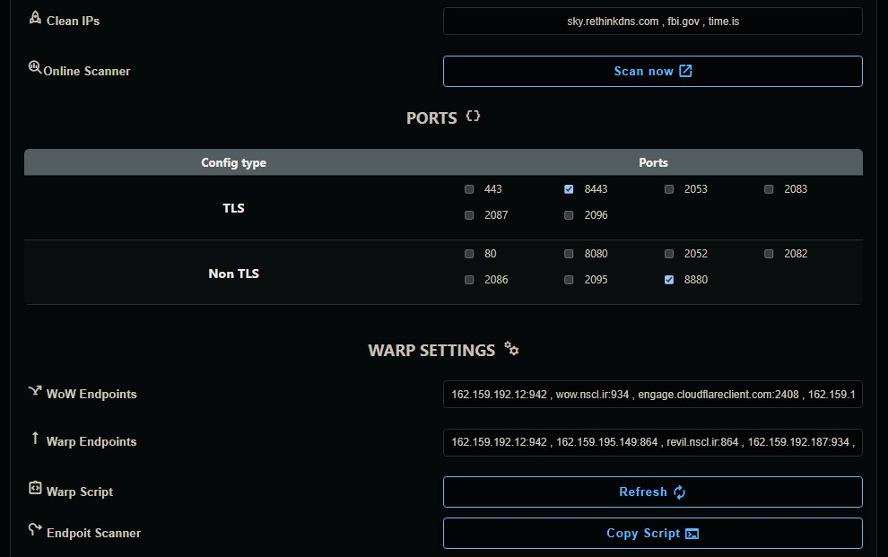
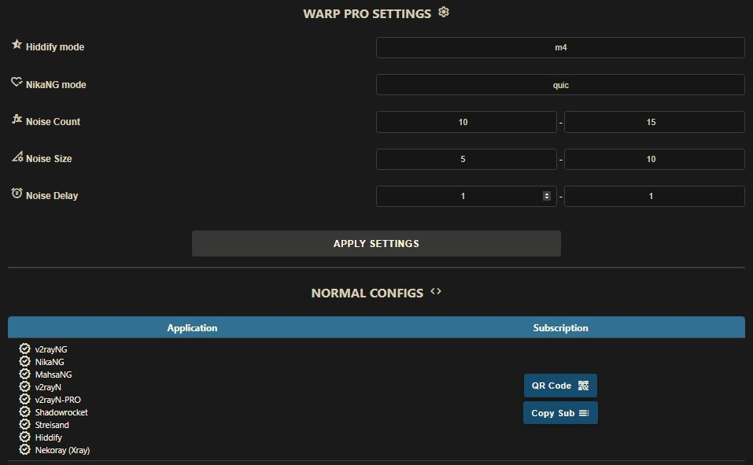
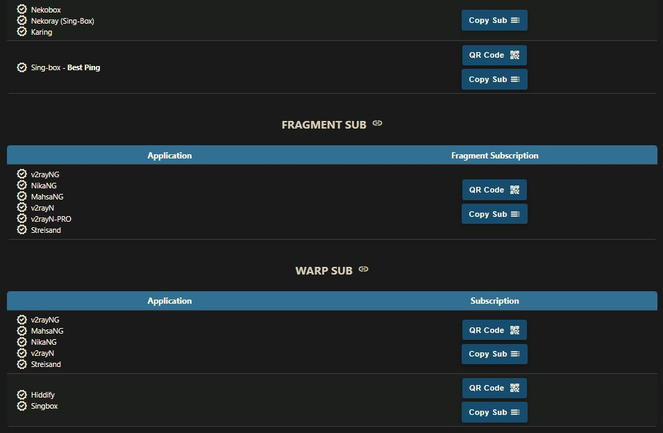
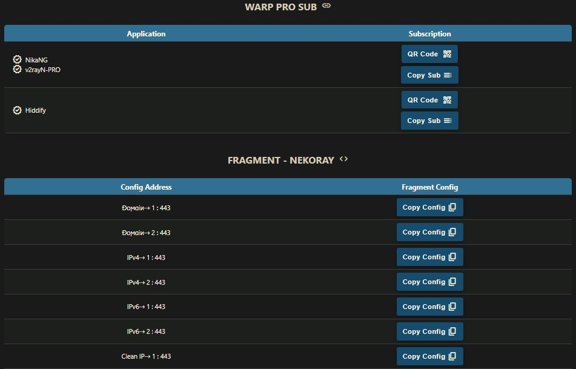
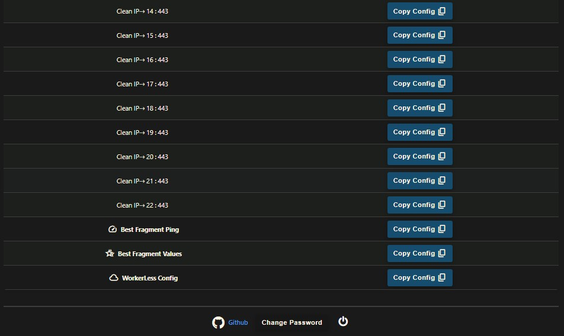

> __[🇮🇷Persian](README-fa.md)__
> 
> __[🇬🇧English](README.md)__

  

  

  

  

  

  

  

## Introduction
This project is dedicated to developing a user panel for the [Cloudflare-workers/pages proxy script](https://github.com/yonggekkk/Cloudflare-workers-pages-vless) created by [yonggekkk](https://github.com/yonggekkk).

HUGE THANKS TO
[bia pain bache](https://github.com/bia-pain-bache) for creating these amazing panel

----

 The panel offers two deployment options:
- __Worker__ deployment
- __Pages__ deployment
 

## Features

1. __Free__: No cost involved.
2. __User-Friendly Panel:__ Designed for easy navigation, configuration and usage.
3. __Protocols:__ Provides VLESS, Trojan and Wireguard (Warp) protocols.
4. __Warp Pro configs:__ Optimized Warp for crucial circumstances.
5. __Support Fragment:__ Supports Fragment functionality for crucial network situations.
6. __Full routing rules:__ Bypassing Iran/China and LAN, Blocking QUIC, Porn, Ads, Malwares, Phishing...
5. __Bypass Iran and LAN (Optional)__
6. __Full routing rules:__ Bypassing Iran, Blocking Ads, Malwares, Phishing... for Sing-box.
7. __Chain Proxy:__ Capable of adding a chain proxy to fix IP.
8. __Supports Wide Range of Clients:__ Offers subscription links for Xray, Sing-box and Clash core clients.
10. __Subscription Link (JSON):__ Provides subscription link for JSON configs.
11. __Password-Protected Panel:__ Secure your panel with password protection.
12. __Fully customizable:__ Ability to use online scanner and setting up clean IP-domains, Proxy IP, setting DNS servers, choosing ports and protocols, Warp endpoints...
 

## How to use:
- [Installation (Pages)](docs/pages_installation_fa.md)

- [Installation (Worker)](docs/worker_installation_fa.md)

- [Scanning Proxy IP](docs/proxy-ip-scanner.md))

- [How to use](docs/configuration_fa.md)

- [FAQ](docs/faq.md)
 

## Supported Clients
| Client  | Version | Fragment | Warp Pro |
| :-------------: | :-------------: | :-------------: | :-------------: |
| __v2rayNG__  | 1.8.19 or higher  | :heavy_check_mark: | :x: |
| __v2rayN__  | 6.42 or higher  | :heavy_check_mark: | :x: |
| __v2rayN-PRO__  | 1.4 or higher  | :heavy_check_mark: | :heavy_check_mark: |
| __Nekobox__  |   | :x: | :x: |
| __Sing-box__  | 1.8.10 or higher  | :x: | :x: |
| __Streisand__  |   | :heavy_check_mark: | :x: |
| __V2Box__  |   | :x: | :x: |
| __Shadowrocket__  |   | :x: | :x: |
| __Nekoray__  |   | :heavy_check_mark: | :x: |
| __Hiddify__  | 2.0.5 or higher  | :x: | :heavy_check_mark: |
| __NikaNG__  |   | :heavy_check_mark: | :heavy_check_mark: |
| __Clash Meta__  |   | :x: | :x: |
| __Clash Verge Rev__  |   | :x: | :x: |
| __FLClash__  |   | :x: | :x: |

---

## Stargazers Over Time

---

### Special Thanks
- CF-vless code author [3Kmfi6HP](https://github.com/3Kmfi6HP/EDtunnel)
- CF preferred IP program author [badafans](https://github.com/badafans/Cloudflare-IP-SpeedTest), [XIU2](https://github.com/XIU2/CloudflareSpeedTest)

---

For a detailed tutorial on the core script, please refer to [Yongge’s blog and video tutorials](https://ygkkk.blogspot.com/2023/07/cfworkers-vless.html).
